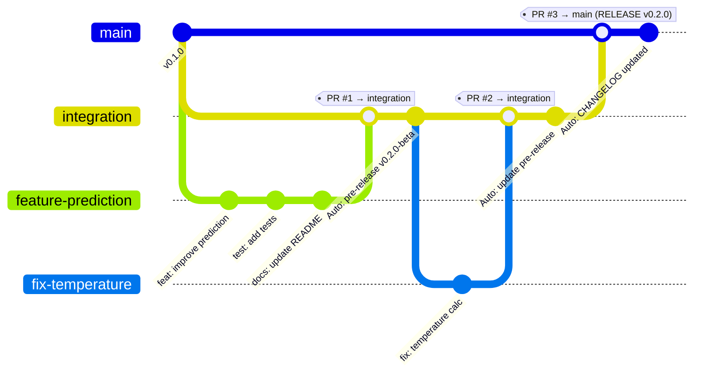

# Workflow de Développement IHP ML Models

## 📊 Vue d'ensemble



## 🔄 Cycle de vie complet

### Phase 1 : Développement

```
┌─────────────┐
│   feature-* │  ← Création depuis integration
│   fix-*     │  
└──────┬──────┘
       │
       │ 1. Développement + Tests (TDD)
       │ 2. Mise à jour CHANGELOG.md
       │ 3. git push origin feature-xxx
       │
       ▼
   [Pull Request]
       │
       │ GitHub Actions:
       │ ✓ Vérif nom branche
       │ ✓ Vérif CHANGELOG
       │ ✓ Tests unitaires
       │ ✓ Docs (si feature)
       │
       ▼
  ┌─────────────┐
  │ integration │
  └─────────────┘
       │
       │ Auto: Pre-release created/updated
       │
       ▼
  [Tests manuels sur instance réelle]
```

### Phase 2 : Pre-release et Tests

```
┌─────────────┐
│ integration │
└──────┬──────┘
       │
       │ Plusieurs features/fixes peuvent être intégrés
       │ Corrections possibles directement sur integration
       │
       ▼
  [Pre-release v.X.Y.Z-beta]
       │
       │ Tests sur instance réelle
       │ ├─ Tests fonctionnels
       │ ├─ Tests de régression
       │ └─ Validation utilisateur
       │
       ▼
  [Prêt pour production ?]
       │
       ├─ Non → Nouvelles corrections → integration
       │
       └─ Oui → prepare-release script
                 │
                 ▼
           Version incrémentée
```

### Phase 3 : Release en production

```
  ┌─────────────┐
  │ integration │  Version bumped (ex: 0.2.0)
  └──────┬──────┘
         │
         │ Pull Request → main
         │
         ▼
    [PR Checks]
         │
         │ GitHub Actions:
         │ ✓ Version > main
         │ ✓ CHANGELOG non vide
         │ ✓ Tests complets
         │ ✓ Checklist affichée
         │
         ▼
    [Merge PR]
         │
         │ Auto-actions:
         │ ├─ Delete pre-release
         │ ├─ Create release v0.2.0
         │ ├─ Update CHANGELOG (date)
         │ └─ Git tag created
         │
         ▼
  ┌─────────────┐
  │    main     │  ← Production (v0.2.0)
  └─────────────┘
```

## 🎯 Cas d'usage

### Cas 1 : Nouvelle fonctionnalité

```bash
# 1. Créer la branche
./scripts/workflow-helper.sh feature
# → Entrer: ml-optimizer

# 2. Développer (TDD)
# - Écrire les tests d'abord
# - Implémenter la feature
# - Tester localement

# 3. Mettre à jour CHANGELOG.md
# Dans [Unreleased] / ### Added:
# - Optimisation automatique des hyperparamètres du modèle ML

# 4. Commit et push
git add .
git commit -m "feat: add ML hyperparameter optimizer"
git push origin feature-ml-optimizer

# 5. Créer PR sur GitHub: feature-ml-optimizer → integration
# → Workflows auto s'exécutent
# → Commentaires auto si problèmes

# 6. Merger la PR
# → Pre-release créée/mise à jour automatiquement
```

### Cas 2 : Correction de bug

```bash
# 1. Créer la branche
./scripts/workflow-helper.sh fix
# → Entrer: memory-leak

# 2. Corriger (avec test de régression)
# - Écrire un test qui reproduit le bug
# - Corriger le code
# - Vérifier que le test passe

# 3. Mettre à jour CHANGELOG.md
# Dans [Unreleased] / ### Fixed:
# - Correction d'une fuite mémoire lors du chargement de modèles

# 4. Commit et push
git add .
git commit -m "fix: resolve memory leak in model loading"
git push origin fix-memory-leak

# 5. Créer PR sur GitHub: fix-memory-leak → integration
# 6. Merger → Pre-release mise à jour
```

### Cas 3 : Préparer une release

```bash
# 1. S'assurer qu'on est sur integration à jour
git checkout integration
git pull origin integration

# 2. Vérifier que la pre-release a été testée
# → Tests sur instance réelle HA
# → Validation des nouvelles features
# → Pas de bugs critiques

# 3. Incrémenter la version
./scripts/workflow-helper.sh prepare-release
# → Choisir: 1=patch, 2=minor, 3=major
# → Script met à jour pyproject.toml
# → Commit et push automatique

# 4. Créer PR sur GitHub: integration → main
# → Workflows vérifient tout
# → Checklist affichée dans commentaire

# 5. Review finale et merge
# → MERGE COMMIT (pas de squash)
# → Release créée automatiquement
```

### Cas 4 : Hotfix post-release

```bash
# Bug critique découvert en production

# 1. Créer fix depuis integration (pas main!)
git checkout integration
./scripts/workflow-helper.sh fix
# → Entrer: critical-crash

# 2. Corriger rapidement
# - Test de régression
# - Correction
# - Mise à jour CHANGELOG

# 3. PR vers integration + merge
# → Pre-release créée

# 4. Test rapide sur instance

# 5. Bump version (patch)
./scripts/workflow-helper.sh prepare-release
# → Choisir 1 (patch)

# 6. PR integration → main
# → Nouvelle release hotfix
```

## 🛡️ Protections et garde-fous

### Automatismes de sécurité

1. **Branch protection sur main**
   - Impossible de push direct
   - Seule `integration` peut merger
   - Force un workflow de review

2. **Branch protection sur integration**
   - Requiert des PR (pas de push direct recommandé)
   - Tests doivent passer

3. **Validation automatique**
   - Nommage des branches (feature-*, fix-*)
   - CHANGELOG toujours à jour
   - Documentation vérifiée pour features
   - Tests unitaires obligatoires

4. **Pre-release obligatoire**
   - Impossible de release sans pre-release
   - Force les tests sur instance réelle
   - Permet corrections itératives

### Checklist avant merge integration → main

- [ ] Pre-release testée sur instance réelle
- [ ] Tous les tests passent (unit + integration)
- [ ] CHANGELOG complet et orienté utilisateur
- [ ] Documentation utilisateur à jour
- [ ] Version incrémentée dans pyproject.toml
- [ ] Aucun bug critique connu
- [ ] Features complètes (pas de WIP)

## 📝 Convention de commit (recommandée)

Pour faciliter la génération automatique de CHANGELOG :

```
feat: description courte (nouvelle fonctionnalité)
fix: description courte (correction de bug)
docs: description courte (documentation seulement)
refactor: description courte (refactoring sans changement fonctionnel)
test: description courte (ajout/modification de tests)
chore: description courte (tâches de maintenance)

Exemples:
feat: add temperature prediction caching
fix: resolve NaN values in feature engineering
docs: update installation guide for Docker
refactor: extract model training to separate service
```

## 🔧 Commandes utiles

```bash
# Voir le workflow complet
./scripts/workflow-helper.sh workflow

# Créer une feature
./scripts/workflow-helper.sh feature

# Créer un fix
./scripts/workflow-helper.sh fix

# Préparer une release
git checkout integration
./scripts/workflow-helper.sh prepare-release

# Vérifier le CHANGELOG avant commit
./scripts/workflow-helper.sh check-changelog

# Voir les branches locales
git branch

# Voir les branches distantes
git branch -r

# Nettoyer les branches locales mergées
git branch --merged integration | grep -v "integration" | grep -v "main" | xargs -r git branch -d

# Voir l'état actuel
git status
git log --oneline --graph --all -10
```

## ⚠️ Points d'attention

### Ne PAS faire

- ❌ Push direct sur `main` (bloqué par protection)
- ❌ Push direct sur `integration` (contourner les PR)
- ❌ Squash merge de integration → main (on veut l'historique)
- ❌ Oublier de mettre à jour le CHANGELOG
- ❌ Merger dans main sans pre-release testée
- ❌ Features techniques dans le CHANGELOG

### À FAIRE

- ✅ Toujours passer par des PR
- ✅ Tester la pre-release sur instance réelle
- ✅ CHANGELOG orienté utilisateur
- ✅ TDD (tests avant code)
- ✅ Merge commit pour integration → main
- ✅ Incrémenter version avant PR main

## 🎓 Philosophie du workflow

> **L'objectif est de garantir que chaque release est stable, testée et documentée, tout en permettant des itérations rapides en pre-release.**

- `integration` est votre bac à sable pour préparer la release
- La pre-release automatique vous permet de tester immédiatement
- Les corrections multiples sur integration sont normales et attendues
- La release vers `main` est l'acte final de publication

Ce workflow privilégie la **qualité** et la **traçabilité** sur la vitesse brute de développement.
