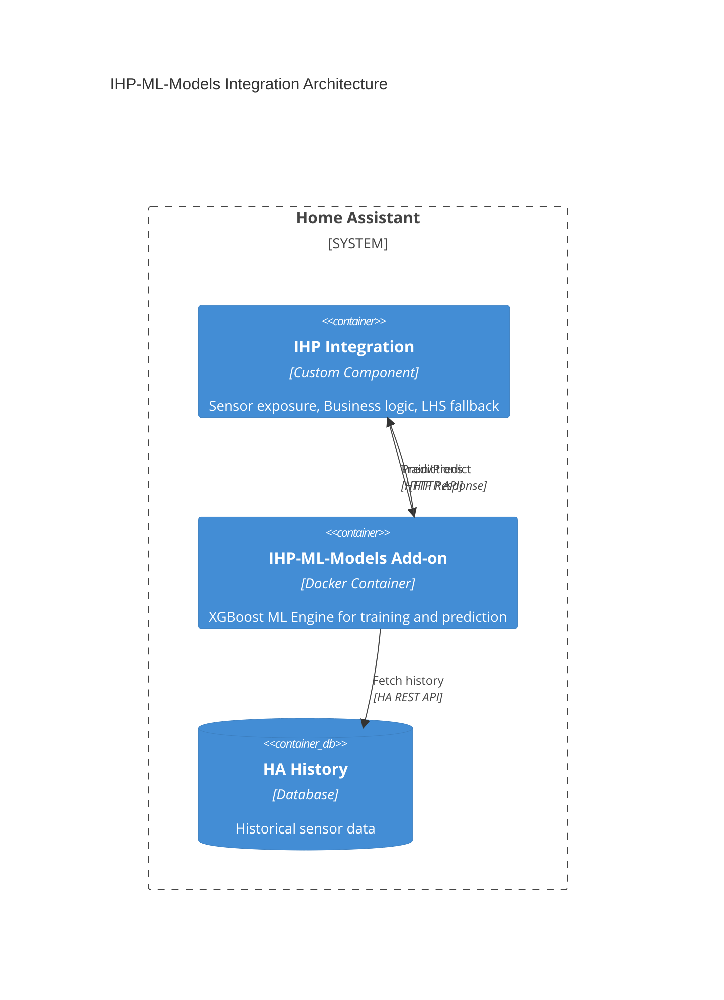

# IHP-ML-Models

[](https://opensource.org/licenses/MIT)

ML Dependency Installer Add-on for Home Assistant. This repository contains a custom HA Add-on designed to resolve complex Python dependency issues (like scikit-learn and XGBoost) required by the Intelligent Heating Pilot (IHP). It ensures a persistent and working Machine Learning environment on Home Assistant OS.

## 🎯 Overview

This add-on provides XGBoost-based machine learning capabilities for the [Intelligent Heating Pilot (IHP)](https://github.com/RastaChaum/Intelligent-Heating-Pilot) integration. It handles:

- **ML Model Training**: Train XGBoost regression models for heating duration prediction
- **Predictions**: Get heating duration estimates based on environmental conditions
- **HTTP API**: REST API for communication with the IHP Custom Component

## 🏗️ Architecture

This project follows **Domain-Driven Design (DDD)** principles with strict separation between business logic and infrastructure concerns:

```
ihp_ml_addon/
├── config.yaml          # Home Assistant add-on configuration
├── Dockerfile           # Docker container setup
├── build.yaml           # Multi-arch build configuration
├── requirements.txt     # Python dependencies
└── rootfs/
    ├── scripts/
    │   └── run.sh       # Add-on entry point
    └── app/
        ├── domain/              # Pure business logic (no external deps)
        │   ├── value_objects/   # Immutable data carriers
        │   ├── interfaces/      # ABC contracts
        │   └── services/        # Domain services
        ├── application/         # Use case orchestration
        │   └── services/
        └── infrastructure/      # External integrations
            ├── adapters/        # XGBoost & storage implementations
            └── api/             # Flask HTTP API
```

## 🚀 Quick Start

### Installation

1. Add this repository to your Home Assistant Add-on Store
2. Install the "IHP ML Models" add-on
3. Start the add-on

### Usage

The add-on exposes an HTTP API on port 5000.

#### Train with Fake Data (for testing)

```bash
curl -X POST http://homeassistant:5000/api/v1/train/fake \
  -H "Content-Type: application/json" \
  -d '{"num_samples": 100}'
```

#### Make a Prediction

```bash
curl -X POST http://homeassistant:5000/api/v1/predict \
  -H "Content-Type: application/json" \
  -d '{
    "outdoor_temp": 5.0,
    "indoor_temp": 18.0,
    "target_temp": 21.0,
    "humidity": 65.0,
    "hour_of_day": 7,
    "day_of_week": 1
  }'
```

#### Check Status

```bash
curl http://homeassistant:5000/api/v1/status
```

## 📡 API Reference

### Endpoints

| Method | Endpoint | Description |
|--------|----------|-------------|
| GET | `/health` | Health check |
| GET | `/api/v1/status` | Service status and model info |
| POST | `/api/v1/train` | Train model with provided data |
| POST | `/api/v1/train/fake` | Train model with generated fake data |
| POST | `/api/v1/train/device` | Train model using HA historical data |
| POST | `/api/v1/predict` | Make heating duration prediction |
| GET | `/api/v1/models` | List all models |
| GET | `/api/v1/models/{id}` | Get model details |
| DELETE | `/api/v1/models/{id}` | Delete a model |

### Request/Response Examples

#### Training with Device Configuration (from IHP component)

This endpoint is used by the IHP component to request training with historical data from Home Assistant.

```bash
curl -X POST http://homeassistant:5000/api/v1/train/device \
  -H "Content-Type: application/json" \
  -d '{
    "device_id": "ihp_salon",
    "indoor_temp_entity_id": "sensor.salon_temperature",
    "outdoor_temp_entity_id": "sensor.outdoor_temperature",
    "target_temp_entity_id": "climate.vtherm_salon",
    "heating_state_entity_id": "climate.vtherm_salon",
    "humidity_entity_id": "sensor.salon_humidity",
    "history_days": 30
  }'
```

Response:
```json
{
  "success": true,
  "device_id": "ihp_salon",
  "model_id": "xgb_a1b2c3d4",
  "created_at": "2024-01-15T06:15:00",
  "training_samples": 245,
  "metrics": {
    "rmse": 3.5,
    "r2": 0.92
  }
}
```

#### Training Request (manual data)
```json
{
  "data_points": [
    {
      "outdoor_temp": 5.0,
      "indoor_temp": 18.0,
      "target_temp": 21.0,
      "humidity": 65.0,
      "hour_of_day": 7,
      "day_of_week": 1,
      "heating_duration_minutes": 45.0,
      "timestamp": "2024-01-15T07:00:00"
    }
  ]
}
```

#### Prediction Response
```json
{
  "success": true,
  "predicted_duration_minutes": 42.5,
  "confidence": 0.85,
  "model_id": "xgb_a1b2c3d4",
  "timestamp": "2024-01-15T06:15:00",
  "reasoning": "Predicted 42.5 minutes to heat from 18.0°C to 21.0°C (outdoor: 5.0°C, humidity: 65%)"
}
```

## 🧪 Development

### Prerequisites

- Python 3.12+
- Poetry (for dependency management)

### Setup

```bash
# Clone the repository
git clone https://github.com/RastaChaum/IHP-ML-Models.git
cd IHP-ML-Models

# Install dependencies
pip install -e ".[dev]"

# Or with poetry
poetry install
```

### Running Tests

```bash
# Run all tests
pytest

# Run with coverage
pytest --cov=ihp_ml_addon

# Run specific test file
pytest tests/unit/domain/test_value_objects.py
```

### Code Quality

```bash
# Lint with ruff
ruff check .

# Type check with mypy
mypy ihp_ml_addon/rootfs/app
```

## 🔧 Configuration

The add-on supports the following configuration options:

| Option | Default | Description |
|--------|---------|-------------|
| `log_level` | `info` | Logging level (debug, info, warning, error) |
| `model_persistence_path` | `/data/models` | Path for model storage |

## 🤝 Integration with IHP

This add-on is designed to work with the [Intelligent Heating Pilot](https://github.com/RastaChaum/Intelligent-Heating-Pilot) custom component:



### Communication Flow

1. **Training**: IHP sends device configuration (sensor entity IDs) → Add-on fetches history from HA → Trains XGBoost model
2. **Prediction**: IHP sends current conditions → Add-on returns predicted heating duration
3. **Fallback**: If addon unavailable, IHP uses LHS (Learning Heating Slope) as fallback

### IHP Component Responsibilities
- Integration with Home Assistant entities
- Sensor exposure (predicted heating time, model status, etc.)
- Business logic (when to start heating based on predictions)
- LHS fallback when add-on is unavailable

### Add-on Responsibilities
- XGBoost model training from historical data
- Heating duration predictions
- Model persistence and versioning
- Fetching historical data from HA REST API

## 📄 License

This project is licensed under the MIT License - see the [LICENSE](LICENSE) file for details.

## 🙏 Acknowledgments

- [Home Assistant](https://www.home-assistant.io/) - The amazing home automation platform
- [XGBoost](https://xgboost.ai/) - Scalable and flexible gradient boosting
- [Intelligent Heating Pilot](https://github.com/RastaChaum/Intelligent-Heating-Pilot) - The parent project
